# SKN01-2nd-3Team
### SK Networks Family AI Camp과정 2차 단위 프로젝트


<br/>

# 1. 팀 소개
### 📢팀명: SP(SpeakingPotato)<br/><br/>
### -팀원 소개-
### 👶🏻김지민: 발표용 팀장
### 👧🏻정아람: 민초 담당 (우리팀 에이스)
### 👦🏻정원형: 팝아트 담당
### 👨🏻‍🏫이호준: 호준과 아이들 교육 담당(+'어떻게 된 일' 담당)
### 👨🏻‍🦱이현석: 꿀호떡 담당<br/><br/>


# 2. 프로젝트 개요
### ✅프로젝트 명: Potrips🥔
### ✅프로젝트 소개
#### 저희 SpeakingPotato(이하 SP)팀이 기획한 POTRIPS는 ‘여행 계획을 짜는 것마저 귀찮은 사람들을 위한 사이트’라는 슬로건으로 많은 사람들이 즐길 수 있는 다양한 국내 여행 패키지 상품을 판매하는 웹 사이트입니다. 바쁜 일상을 살고 있는 현대인들이 여행을 준비하는 과정에서 시간과 노력을 절약할 수 있도록 다양한 여행 패키지 상품을 한 눈에 비교하고 선택할 수 있게 서비스를 제공하여 손쉽게 여행을 갈 수 있도록 도움을 줍니다.
#### POTRIPS는 자체 제작한 귀여운 감자 캐릭터들과 사용자 친화적인 UI, 그리고 직관적인 예약 시스템을 통해 누구나 쉽고 기분 좋게 이용할 수 있으며, 다양한 컨셉의 여행 상품들이 있어 사용자에게 선택의 다양성을 제공합니다.


### ✅프로젝트 필요성(배경)
#### 현대 사회에서는 여행 상품 사이트의 이용률이 날로 증가하고 있습니다. 이는 예전과 달리 여행을 떠나려는 사람들이 여행을 계획하고 준비하는 과정에서부터 편리함을 추구하고 있다는 증거라고 해석할 수 있습니다. 또한, 스스로 여행 계획을 짜는 것은 여행의 자유로움을 더해줄 수 있지만 여행지에 대한 정보가 부족한 점 등으로 인해 각 지역에서 체험할 수 있는 다양한 활동들을 해보는 것에 어려움을 겪을 수 있습니다. 하여, 저희 SP팀은 이러한 문제점들과 여행객들의 여러 니즈를 고려하여 이용객이 원하는 '편리함'과 '각 지역만의 여러 활동 체험'을 잘 융합시킨 여행 상품 사이트가 필요하다고 생각하여 POTRIPS를 제작하게 되었습니다.


### ✅프로젝트 목표
#### POTRIPS을 통해 많은 사람들이 여행 계획의 번거로움에서 벗어나 즐겁고 편리한 여행을 즐길 수 있도록 하는 것이 POTRIPS의 목표입니다. 또한, 사용자들의 다양한 요구를 충족시키는 맞춤형 서비스를 통해 높은 만족도를 제공하고, 지속적인 성장을 이루어낼 수 있도록 노력하여 POTRIPS는 여행을 사랑하는 모든 사람들에게 최고의 여행 파트너가 될 것입니다.<br/><br/>


# 3. 기술 스택
### FRONTEND


### BACKEND


### AI CORE


### IDE


### COLLABORATION


### INFRA


<br/><br/><br/>

# 4. 가설과 가설 검증
## 👉🏻구매동향 예측


### ✅ 가설 - 나이별로 여행지별 선호도가 다를 것이다.
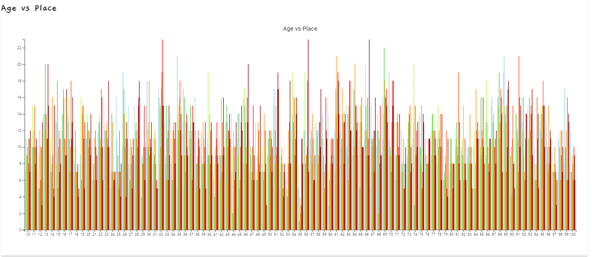

#### ✅ 가잠 먼저 나이대별로 여행지의 상관분석을 진행해보니 같은 나잇대임에도 나이 별로 선호하는 여행지가 매우 다른 것을 확인할 수 있음, 이는 곧 데이터에 이상치가 너무 많음을 알게 되어 가설 검증 전 전처리(이상치) 제거를 먼저 진행하기로 결정<br/><br/>
#### -전처리 진행
    def load_data(orders_file, survey_file):
        orders_df = pd.read_excel(orders_file)
        survey_df = pd.read_excel(survey_file)
        return orders_df, survey_df

    def merge_data(orders_df, survey_df):
        merged_df = pd.merge(orders_df, survey_df, on=['accountId'])
        return merged_df

    def preprocess_data(merged_df):
        merged_df['age'] = merged_df['age'].fillna(0)
        return merged_df

    def export_data_to_excel(df, filePath):
        df.to_excel(filePath, index=False, engine='openpyxl')
        print(f"전처리 완료 : {filePath}")


    orders_info_file = "travel_orders_data.xlsx"
    survey_info_file = "survey_data.xlsx"
    output_file = "preprocessed_orders_data.xlsx"

    orders_df, survey_df = load_data(orders_info_file, survey_info_file)
    merged_df = merge_data(orders_df, survey_df)
    preprocessed_df = preprocess_data(merged_df)
    export_data_to_excel(preprocessed_df, output_file)

### 👉🏻BoxPlot


#### ✅ 우리의 가설에 맞는 검증을 시도하기 위해 전처리를 진행한 후 전처리가 잘 된 모습을 확인할 수 있다.<br/><br/>


### 👉🏻Confusion Matric
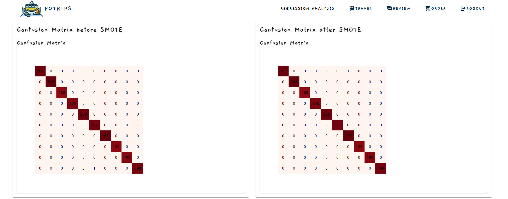

#### ✅ Confusion Matric로 확인해보니 실제로도 정확한 예측을 하고 있는 것을 알 수 있다. <br/><br/>


## 👉🏻이탈고객 예측

### ✅ 가설 - 나이가 70세 이상인 고객들은 이탈률이 높을 것이다.
#### &emsp;&emsp;✅ 이탈의 기준을 현재(7월)를 기준으로 마지막 이용일로부터 현재까지 6개월간 이용이 없다면 이탈한 것으로 판단
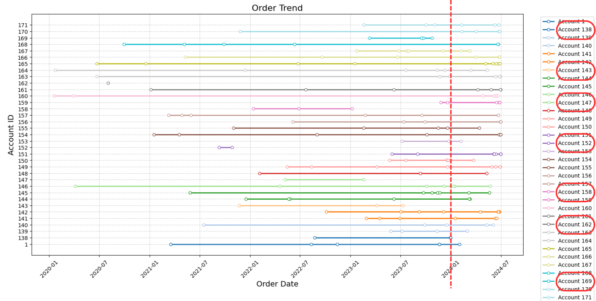
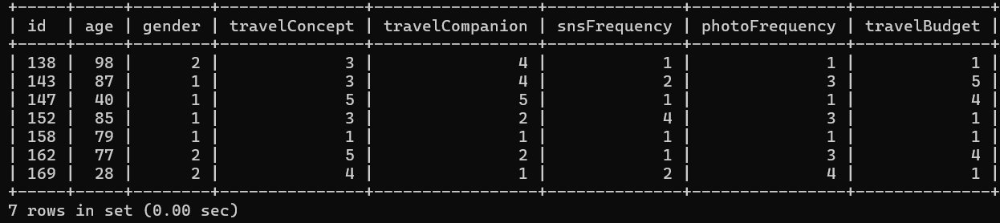

#### ✅ 검증 결과 - 이탈고객을 분석해본 결과 70대 이상의 고객들의 이탈률이 높은 것으로 나타났다.
<br/><br/>

# 5. Agile Board (애자일 보드)

#### 👉🏻Djawngo Backlog
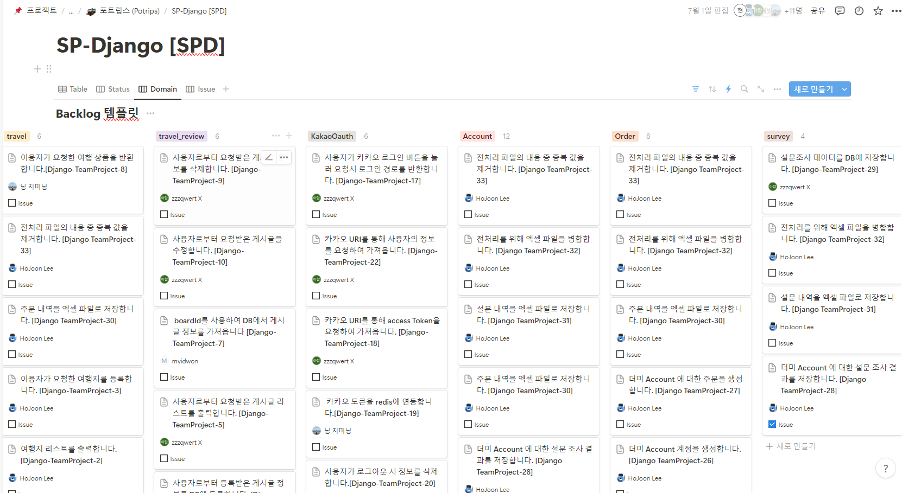<br/>

#### 👉🏻Backlog와 commit 일치
<br/>

<hr/>

#### 👉🏻Vue Backlog


#### 👉🏻Backlog와 commit 일치
<br/>
### 📢저희 SP팀은 프로젝트를 진행하면서 각자 Domain단위가 아닌 기능 단위로 구현을 진행하였습니다.<br/><br/>

# 6. Commit History (커밋 이력)

### 👉🏻Django commit


<hr/>

### 👉🏻Vue commit


### 📢처음엔 더뎠지만 프로젝트 후반으로 갈수록 모든 팀원들의 실력이 향상되어 커밋 그래프가 우상향을 그리는 것을 확인할 수 있습니다.<br/><br/>


# 7. 발생한 이슈 내역  
### ✅makemigration실행 시 non-nullable field오류가 발생하는 이슈
<br/>

<br/>
<hr/>

### ✅DB를 수동으로 drop한 이후 makemigrations와 migtrte가 되지 않는 이슈


# 8. ERD
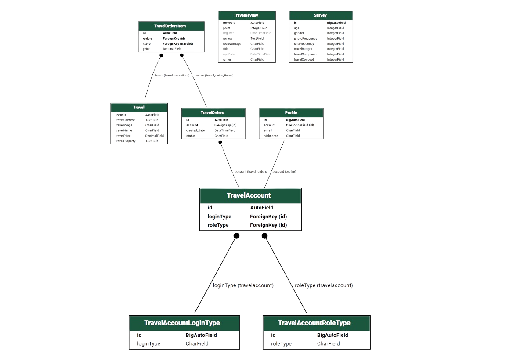

# 9. 주요 Domain 요소들

#### 👉🏻Django 전체 Domain 구조
```|
-- first_project
|-- kakaoOauth
|   |-- controller
|   |-- migrations
|   |-- serializer
|   `-- service
|-- sample_data
|   `-- preprocess
|-- survey
|   |-- controller
|   |-- entity
|   |-- migrations
|   |-- repository
|   `-- service
|-- travel
|   |-- controller
|   |-- entity
|   |-- migrations
|   |-- repository
|   `-- service
|-- travel_account
|   |-- controller
|   |-- entity
|   |-- migrations
|   |-- repository
|   `-- service
|-- travel_orders
|   |-- controller
|   |-- entity
|   |-- migrations
|   |-- repository
|   `-- service
`-- travel_review
    |-- controller
    |-- entity
    |-- migrations
    |-- repository
    `-- service

38 directories
```

#### 👉🏻Django 전체 directory 구조


#### 👉🏻Domain별 세부 구조
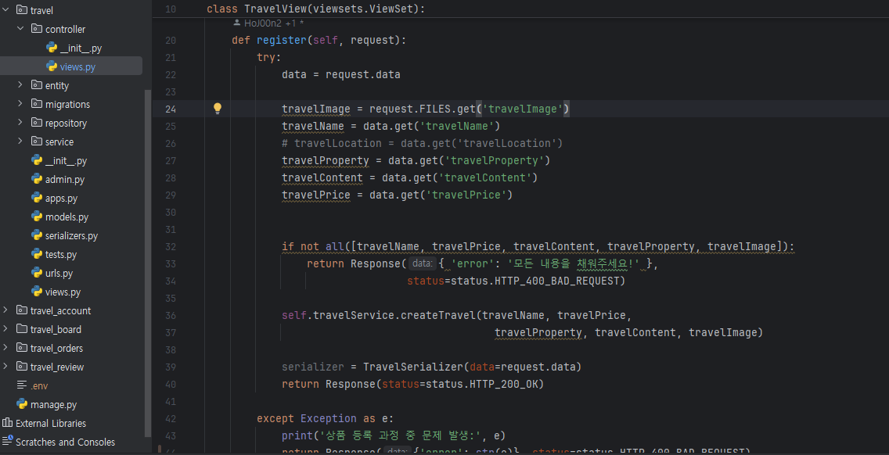

#### 📢위와 같이 Django의 Domain들은 DDD구조로 설계하였으며, 각각의 Domain들은 controller,entity,repository,service를 지니고 있습니다. 

<hr/>

#### 👉🏻Vue 전체 Domain 구조
```
|-- account
|   |-- pages
|   |-- router
|   `-- store
|-- assets
|   |-- font
|   `-- images
|-- authentication
|   |-- redirection
|   |-- router
|   `-- store
|-- components
|-- home
|   |-- pages
|   `-- router
|-- logisticRegression
|   |-- pages
|   `-- router
|-- navigationBar
|-- order
|   |-- pages
|   |-- router
|   `-- store
|-- plugins
|-- randomForest
|   |-- components
|   |-- pages
|   `-- router
|-- router
|-- store
|-- survey
|   |-- pages
|   `-- router
|-- travel
|   |-- pages
|   |-- router
|   `-- store
|-- travel_review
|   |-- pages
|   |-- router
|   `-- store
|-- utility
`-- views
43 directories
```

#### 👉🏻Vue 전체 directory 구조


#### 👉🏻Domain별 세부 구조
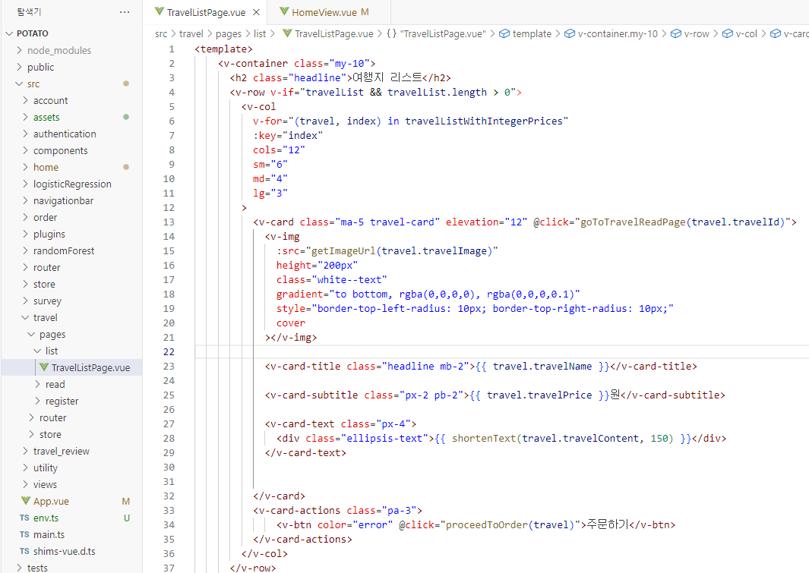


#### 📢위와 같이 Vue의 Domain들은 각각 pages,router를 지니고 있으며, Domain의 특성상 list와 register, modify,store 등을 지닌 Domain들이 존재합니다.<br/><br/>


# 10. 수행결과(테스트/시연 페이지)
#### 👉🏻Home 화면

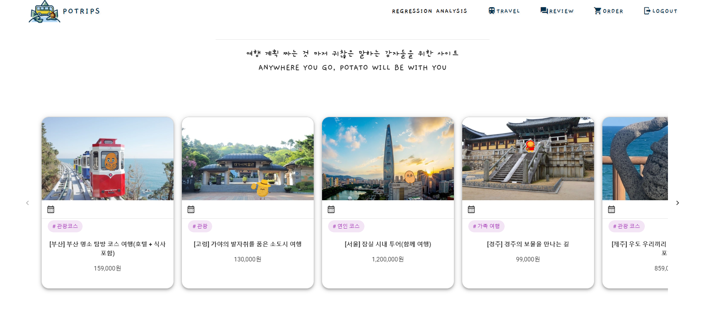
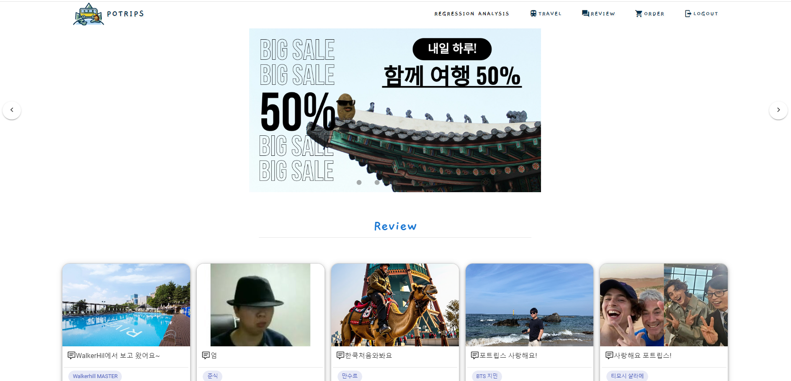

#### 📢Home화면 상단엔 Navigationbar를 배치하여 RegressionAnalysis와 travel, review, order, login 페이지로 이동하는 버튼을 만들었고, 중단엔 여행 상품들을, 하단엔 이용객들이 작성한 리뷰들이 나오도록 배치했습니다.
<hr/>

#### 👉🏻travel 페이지
#### -여행지 리스트
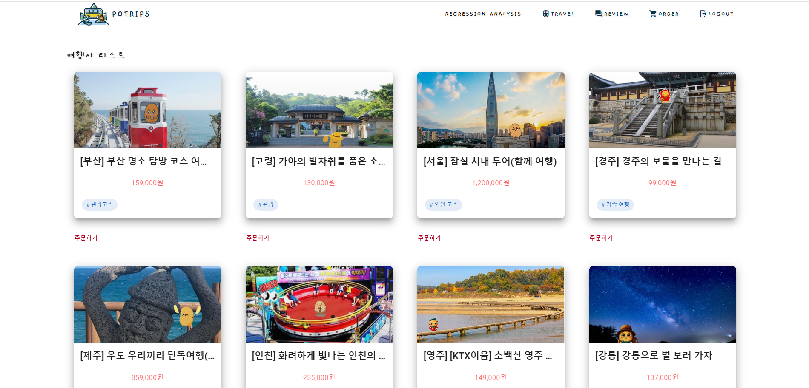

#### -여행지 상세 페이지
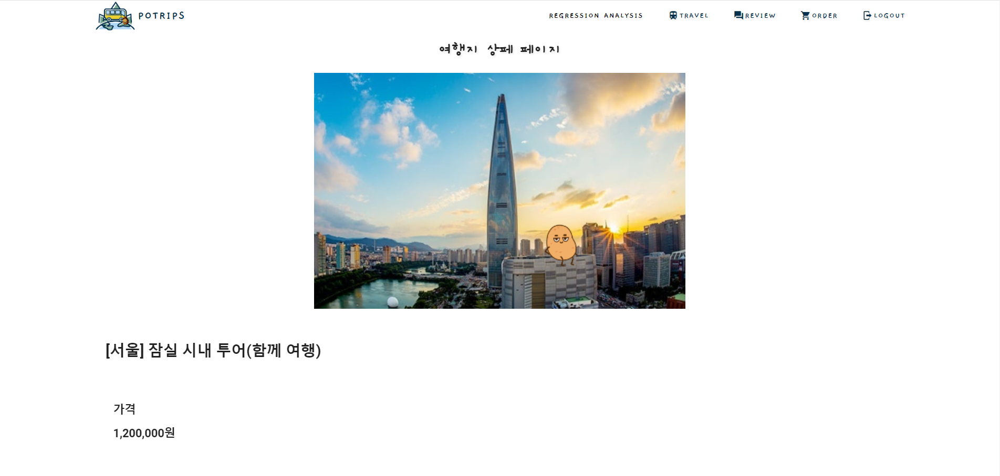
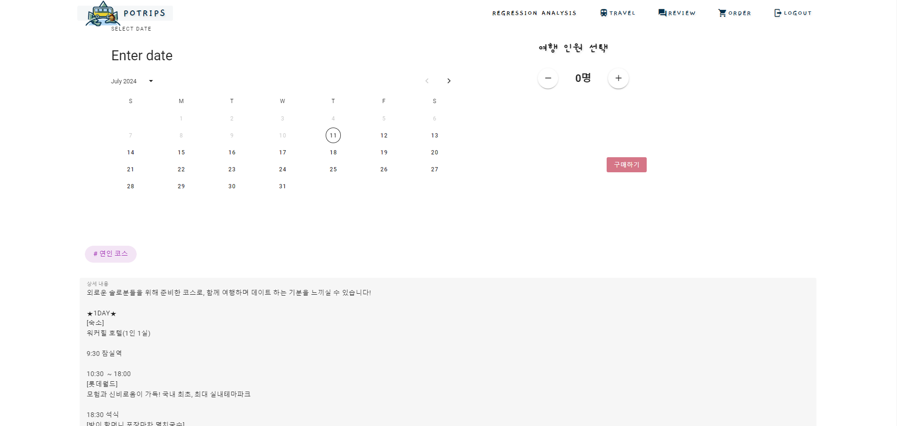

#### 📢travel 페이지는 판매중인 여행지 리스트가 나타나고 각 여행지마다 상세페이지로 진입할 수 있으며, 상세페이지에서 구매하기 기능이 가능합니다.
<hr/>

#### 👉🏻review 페이지
#### -review 리스트
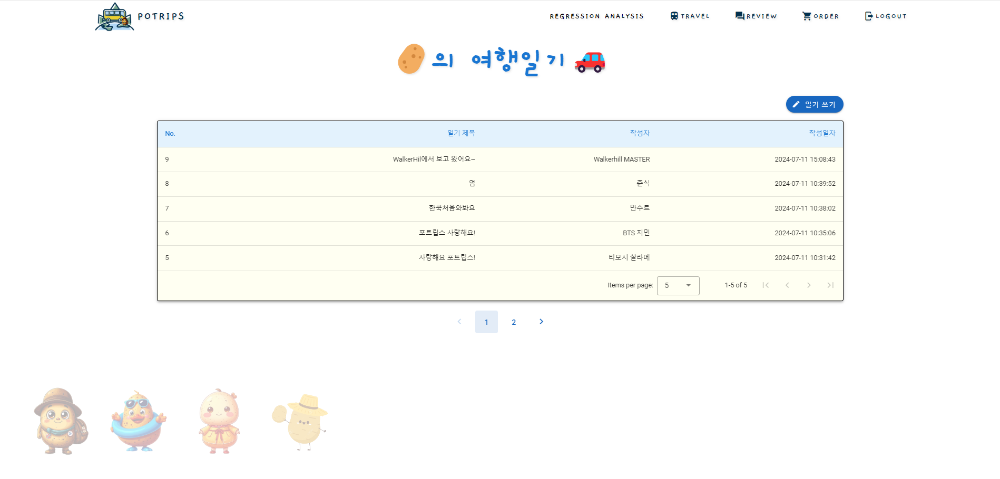<br/>

#### -review 작성
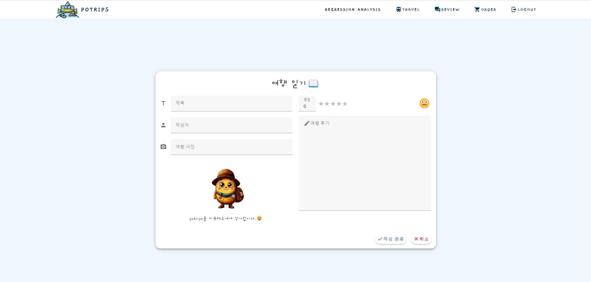<br/>

#### -review 상세 페이지
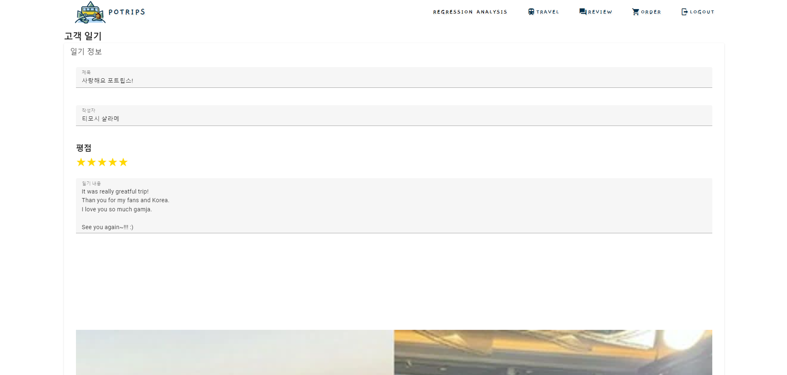
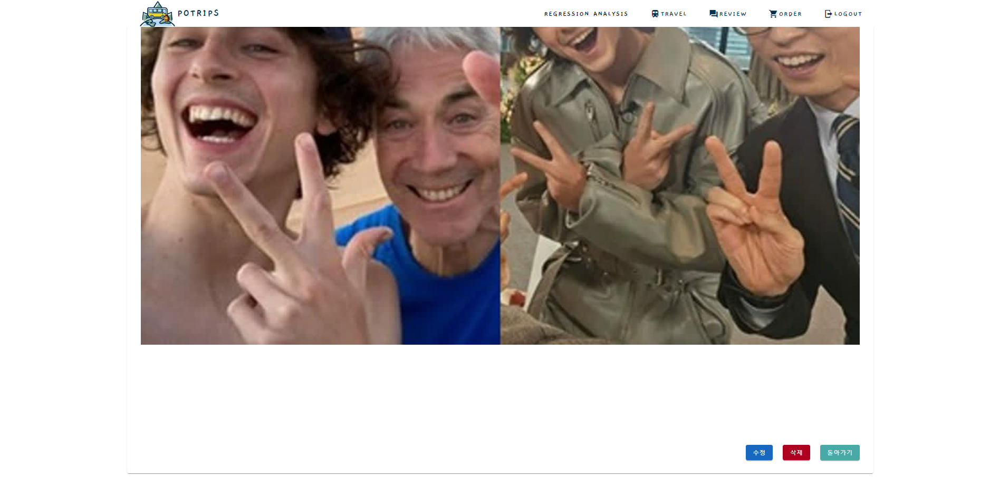<br/>

#### 📢review 페이지는 이용객들이 작성한 리뷰들이 나타납니다. 세부적으로 리뷰 리스트, 작성 페이지, 수정 페이지가 존재합니다.<br/>
<hr/>

#### 👉🏻order 페이지
#### -order 리스트


#### -order 상세 페이지
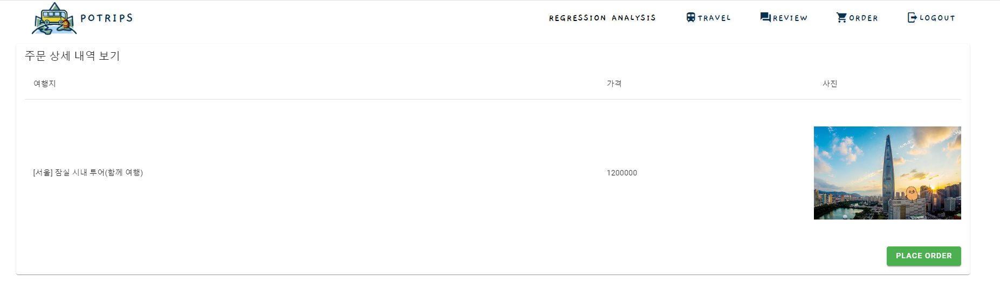

#### 📢order 페이지는 이용객이 구매한 여행지 리스트가 나타나며 리스트를 클릭하게 되면 주문 상세 내역 보기로 진입합니다.<hr/>

#### 👉🏻login 페이지
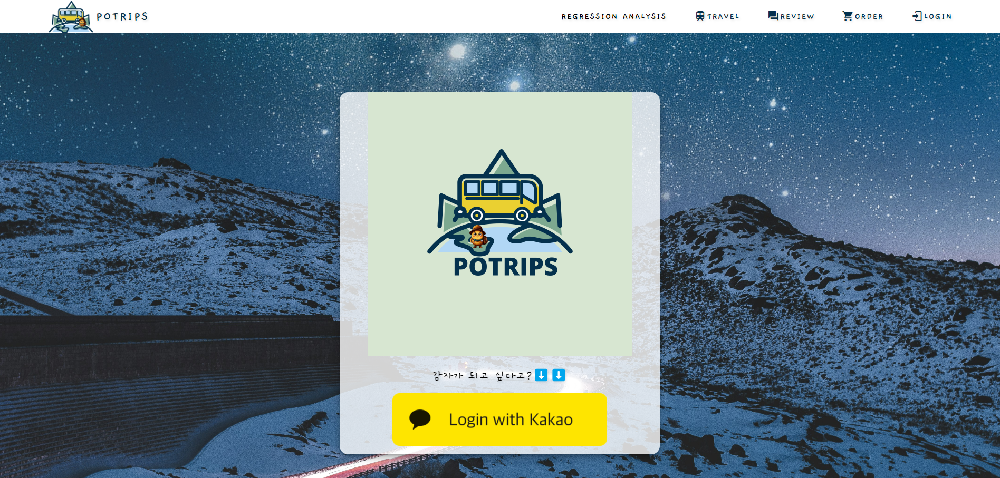

#### 📢POTRIPS의 login페이지 입니다.<br/><br/>


# 11. 감동의 한 줄 회고😭

### 👶🏻지민: 앞으로 이렇게 좋은 팀원들과 프로젝트를 할 수 있을지 모르겠다. 행복한 1달이었다.

### 👧🏻아람: 좋은 팀원들을 만나 이번 프로젝트를 진행하는 동안 비록 초반에 속도는 조금 늦었지만 다같이 공부하면서 성장할 수 있었던 시간이었던 것 같아 좋았다.

### 👦🏻원형: 직접 데이터를 분석해보고, Vue로 서비스를 간단히 개발하며 시각화한 것이 새로운 도전이며 재밌었습니다!

### 👨🏻‍🏫호준: 함께 협업을 하면서 강사님이 알려주신 애자일 방식으로 진행해야 하는 이유와 DDD 방식으로 코드를 구성해야 하는 이유에 대해서 몸소 깨달을 수 있어 좋았다.그리고 1달 이상을 팀원들과 열심히 복습하고 프로젝트를 진행했는데, 다들 점점 실력이 오르는게 눈에 보여서 매우 뿌듯했다. 앞으로 어딜 가더라도 맡은 일은 잘 할 수 있을거라 믿는다! 다들 고생했어~

### 👨🏻‍🦱현석: 프로젝트를 진행하면서 DDD구조의 효율성을 직접 느끼게 되었던 기회가 되었던 것 같고 많은 것들을 배울 수 있었습니다. 그러나 그 과정에서 제가 아직 많이 부족하다는 것도 느꼈습니다. 그럼에도 좋은 팀원들과 함께 해서 프로젝트를 잘 마무리 할 수 있었다고 생각합니다. 팀원들에게 고맙다는 인사를 남깁니다.